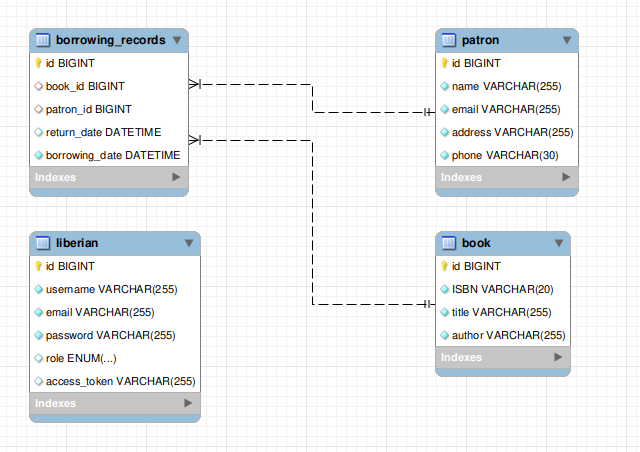

# Library Management System API

This project is a Library Management System API built using Spring Boot. It allows librarians to manage books, patrons, and borrowing records efficiently.

## Table of Contents

1. [Project Description](#project-description)
2. [Database erd](#project-description)
3. [Features](#features)
4. [Technologies Used](#technologies-used)
5. [API Documentation](#api-documentation)

## Project Description

The Library Management System API is designed to streamline the operations of a library by allowing librarians to manage books, patrons, and borrowing records efficiently. Built using Spring Boot, this system provides a robust and scalable backend for library management, offering RESTful endpoints for easy interaction.

## Database erd

## Features

### 1- Authentication and Authorization
- **Add a new liberian**  
  `POST /api/auth/register`  
   allows the registration of a new librarian in the library system.

- **Retrieve a token or authorization**  
  `POST /api/auth/login`  
  authenticate and receive a token for authorized access to the library system by email and password.

### 2- Book Management

- **Retrieve a list of all books**  
  `GET /api/books`  
  Retrieves a list of all books in the library.

- **Retrieve details of a specific book by ID**  
  `GET /api/books/{id}`  
  Retrieves details of a specific book identified by its ID.

- **Add a new book to the library**  
  `POST /api/books`  
  Adds a new book to the library with provided details.

- **Update an existing book's information**  
  `PUT /api/books/{id}`  
  Updates the information of an existing book identified by its ID.

- **Remove a book from the library**  
  `DELETE /api/books/{id}`  
  Removes a book from the library using its ID.

### 3- Patron Management
- **Retrieve a list of all patrons**  
  `GET /api/patrons`  
  Retrieves a list of all patrons registered in the system.

- **Retrieve details of a specific patron by ID**  
  `GET /api/patrons/{id}`  
  Retrieves details of a specific patron identified by their ID.

- **Add a new patron to the system**  
  `POST /api/patrons`  
  Adds a new patron to the system with provided details.

- **Update an existing patron's information**  
  `PUT /api/patrons/{id}`  
  Updates the information of an existing patron identified by their ID.

- **Remove a patron from the system**  
  `DELETE /api/patrons/{id}`  
  Removes a patron from the system using their ID.

### 4- Borrowing Records
- **Allow a patron to borrow a book**  
  `POST /api/borrow/{bookId}/patron/{patronId}`  
  Allows a patron to borrow a book, specifying the book and patron IDs.

- **Record the return of a borrowed book by a patron**  
  `PUT /api/return/{bookId}/patron/{patronId}`  
  Records the return of a borrowed book by a patron, specifying the book and patron IDs.

## Technologies Used

- **Java**  
- **Spring Boot**  
- **Spring Data JPA**  
- **Spring AOP**  
- **Spring Security**  
- **Caching**
- **Maven**  
- **My-sql**  

## API Documentation

- **Swagger Documentation**:
  - Access the Swagger UI to explore the API endpoints:
    - URL: `http://localhost:8080/swagger-ui/index.html`

- **Authentication Endpoints**:
  - `POST /api/auth/register`
  - `POST /api/auth/login`

- **Book Endpoints**:
  - `GET /api/books/`
  - `GET /api/books/{id}`
  - `POST /api/books/`
  - `PUT /api/books/`
  - `DELETE /api/books/{id}`
  
- **Patron Endpoints**:
  - `GET /api/patrons/`
  - `GET /api/patrons/{id}`
  - `POST /api/patrons/`
  - `PUT /api/patrons/`
  - `DELETE /api/patrons/{id}`

- **Borrowing endpoints**:
  - `POST /api/borrow/{bookId}/patron/{patronId}`
  - `PUT /api/return/{bookId}/patron/{patronId}`

## Additional Notes

- **Authentication and authorization are required.**
  - `Book, Patron, Borrowing`

